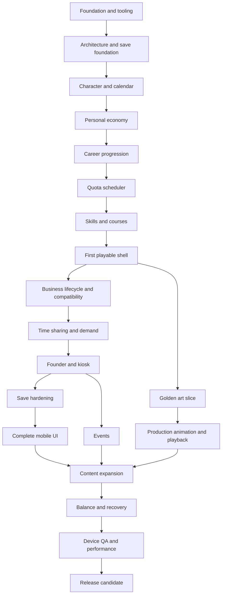

# Startup Life — MVP Implementation Plan

## 1. Summary, current state, and resolved decisions

Build a portrait-first, offline Unity mobile game that proves the complete employment → skills → side businesses → resignation → founder journey.

The first delivery gate is a small playable Developer workday with evening study and reliable save/resume. Production art and content expansion follow separate verification gates.

**Artifact status:** Saved as the authoritative implementation ledger at `docs/IMPLEMENTATION_PLAN_MVP.md` on September 30, 2026. The planning audit below is retained as a historical baseline; current task state is tracked in `ACTIVE_STATUS` and the roadmap checkboxes.

### ACTIVE_STATUS

- **Current phase:** M8-T01 is **CLOSED** after exact Unity runtime acceptance and tracked TMP font-determinism verification; M8-T02 remains pending the closeout merge.
- **M8-T01:** **CLOSED — Unity runtime acceptance and tracked-asset determinism verified**. See [font determinism closeout](evidence/M8-T01/FONT_DETERMINISM_2026-10-07.md).
- **iOS:** **DEFERRED — NOT RUN — owned by M18-T02**. Missing Mac/Xcode/iPhone infrastructure is not represented as PASS.
- **Physical Android:** **NOT RUN — owned by M18-T01**. Android emulator evidence from M7-T02 does not satisfy the physical-device gate.
- **M0-T04:** **OPEN — deferred Mac/iOS prerequisite work remains**. Only those deferred iOS subcriteria cease to block current Windows/Android functional task progression under ADR-010; unrelated prerequisites remain required.
- **Save/schema:** SaveVersion 2; this font-determinism closeout changes no persisted field or migration.
- **Evidence root:** `docs/evidence/<TASK-ID>/`.

### CURRENT_STATE

Historical audit performed against `C:\Users\viett\OneDrive\Desktop\Startup` before M0 implementation on September 30, 2026. Its observations are preserved for provenance and must not be read as the live repository state.

| Area | Status | Observed state |
|---|---|---|
| Design documents | EXISTS | Full GDD, MVP plan, production workflow, and skills manifest exist at repository root. |
| Agent instructions | EXISTS | `AGENTS.md` contains the project invariants and ownership rules. |
| Project skills | EXISTS | All four project-specific skills exist under `.agents/skills`. |
| Documentation layout | PARTIAL | Required sources exist, but canonical `docs/...` paths and implementation progress file are missing. |
| Official Unity skills | EXISTS | Local setup, CLI, package, uGUI, localization, sprite, and atlas skills are available. |
| Community production skills | MISSING | Required `unity-game-*`, art, animation, bridge, localization, profiler, and QA skills were not found in the inspected skill roots. |
| Unity project | MISSING | No `Assets`, `Packages`, `ProjectSettings`, scenes, prefabs, definitions, or assemblies exist. |
| Editor installation | UNVERIFIED | No running Unity process, standard Editor installation, or `unity` CLI command was detected. Alternate installations cannot be ruled out. |
| Engine/render/mobile configuration | MISSING | Unity version, URP renderer, portrait settings, and platform modules cannot be verified without a project/editor. |
| Simulation and saves | MISSING | No services, state models, persistence, or migration implementation. |
| Art and animation | MISSING | No placeholders, Golden Assets, approved registry, layered character sources, or rigs. |
| Git | MISSING | This folder is not a Git repository; branch, status, remote, and commit history do not exist. |
| CI/testing | MISSING | No test assemblies, workflows, build scripts, or verification artifacts. |
| Unity automation | MISSING | No callable Unity tools or configured Unity MCP entry were detected. |
| Supporting tools | PARTIAL | Git, Git LFS, Node, npm tooling, and .NET are available. Working Python/`uv` setup remains unverified. |
| Active milestone | MISSING | Existing MVP checklists are unchecked; implementation starts at M0. |

### SPEC_CONFLICTS

**No blocking gameplay conflicts remain after the user’s decisions below.**

Record these reconciliations explicitly:

| Overlap or conflict | Resolution |
|---|---|
| Workflow references nonexistent `docs/...` files | Normalize the existing authoritative documents in M0 without changing their design meaning. |
| Sample roadmaps place saves and mobile UI late | Establish save contracts and a minimal mobile shell early; retain later hardening milestones. |
| GDD and MVP list different assembly/save-root summaries | Use the fuller nine-assembly architecture and one logical save model covering all MVP state. |
| Marketing examples mention Creativity | MVP remains restricted to the six approved transferable skills. Creativity is deferred. |
| Community skill pack recommends a newer Unity release | Unity 6.3 LTS remains locked; verify and pin a compatible skill/tool revision before use. |
| General skill defaults suggest stronger post-processing or monetization | Project-specific restrained 2D rendering and offline MVP scope take precedence. |
| Full GDD describes richer employees and managers | MVP includes one fixed Coffee Kiosk helper; management and recruitment remain deferred. |

The community pack is iOS-oriented and currently recommends a newer Editor, so compatibility and Android coverage require explicit verification. [Community skill repository](https://github.com/tea-x-random/unity-game-skills)

### User-confirmed product decisions

- Vietnamese-first UI and content; localization keys are established immediately.
- One fictional contemporary HCMC-inspired urban district.
- Soft colored outlines, matte shading, and clear silhouettes.
- Cash remains nonnegative. Unpaid expenses become recoverable arrears without loans or interest.
- Multiple businesses: one active instance of each MVP type, maximum four.
- Automatic sharing of eligible owner time.
- Coffee Kiosk reserves its required daytime hours; side businesses share remaining eligible hours.
- Study consumes time that would otherwise be available to businesses.
- Simulation time pauses while the application is closed or suspended.
- iOS builds use a Mac host with matching Unity, Xcode, signing setup, and physical iPhone QA.

### MVP boundary

Deliver:

- Six careers and six transferable skills.
- Four business types and four aggregate customer segments.
- Twenty events.
- Thirty-three career/business visual recipes using nine reusable environments.
- Character creation for ages 18–40, male/female presentation, hair/outfit choices, and starting backgrounds.
- Local saves, biography/history, and the complete first founder arc.
- One simplified kiosk helper.
- Android and iOS release-candidate builds.

Exclude cloud services, monetization, loans, advanced employees, manager operation, multiple cities, detailed inventory, manual professional minigames, and unrestricted job switching between employers.

## 2. Architecture, interfaces, and simulation contracts

### Assembly boundaries

| Assembly | Responsibility and permitted dependencies |
|---|---|
| `StartupLife.Core` | IDs, money/time value types, state models, domain results, ports. No Unity dependencies. |
| `StartupLife.Simulation` | Calendar, careers, skills, courses, economy, businesses, demand, events, history. Depends on Core only. |
| `StartupLife.Application` | Commands, orchestration, snapshots, save checkpoints, composition interfaces. Depends on Core and Simulation; no Unity dependencies. |
| `StartupLife.Content` | ScriptableObject definitions, validation, conversion into immutable simulation definitions. |
| `StartupLife.Infrastructure` | JSON serialization, local storage, migrations, save recovery, platform adapters. |
| `StartupLife.Presentation` | uGUI/TMP views, scene playback, animation, input, lifecycle bridge, Unity composition root. |
| `StartupLife.Editor` | Content import/validation, asset gates, BeautyCell tools, build automation. Editor-only. |
| `StartupLife.Tests.EditMode` | Scene-independent simulation, content, persistence, migration, and determinism tests. |
| `StartupLife.Tests.PlayMode` | Bootstrap, UI, playback, lifecycle, and save/resume integration. |

ScriptableObjects author immutable content. Simulation receives plain C# definitions and never reads Unity assets directly.

### Public interfaces and data

Establish these contracts before feature implementation:

- `IGameCommands`: character creation, job acceptance, course purchase/study, business launch/closure, pricing, reinvestment, resignation, and time advancement.
- `CommandResult`: success or a stable failure reason; rejected commands make no state changes.
- `GameSnapshot`: immutable presentation-facing state.
- `SimulationOutcome`: committed rewards, transactions, history entries, and presentation cues.
- `AdvanceDay()`, `AdvanceMonth()`, `ApplyCareerScene()`, and `SimulateBusinessDay()`: callable without loading a Unity scene.
- `ISaveStore`, `ISaveSerializer`, and `ISaveMigration`: storage, serialization, and sequential migration boundaries.

Content definitions include:

`CharacterStartDefinition`, `DayScheduleDefinition`, `CareerDefinition`, `CareerSceneDefinition`, `SkillDefinition`, `CourseDefinition`, `BusinessDefinition`, `CustomerSegmentDefinition`, `EventDefinition`, and `EconomyBalanceDefinition`.

All definitions use stable IDs and localization keys. Runtime ownership uses instance IDs, including business instances and historical employers.

### Authoritative time and rewards

- Use integer simulation minutes and Gregorian calendar dates.
- Career schedules define working days and hours, including F&B weekend shifts.
- Career tenure uses calendar service duration; XP and salary accrual require completed work.
- Rendering speed and vignette duration never change simulated rewards.
- Commit each activity outcome once, identified by its simulation operation ID.
- Animation events provide visual feedback only; they cannot grant money or progression.
- Required choices pause advancement. Ordinary activity playback follows the committed simulation timeline.
- `AdvanceMonth()` stops at an unresolved player choice rather than silently selecting an outcome.
- Employment and founder transitions take effect at the next activity boundary.
- Application suspension preserves the current boundary/cursor without real-world catch-up.

### Career quota scheduling

Use a configured quota cycle, initially twenty slots for Developer:

`8 Coding / 4 Meeting / 3 Bug Fixing / 2 Client Discussion / 2 Demo / 1 Documentation`.

For other weights:

- Require nonnegative weights totaling 100%.
- Convert weights with largest-remainder apportionment.
- Resolve equal remainders by stable scene ID.
- Order the deck deterministically, avoiding adjacent repeats when another remaining scene is available.
- Use an explicitly versioned PRNG with independent scheduler and event streams.
- Persist the actual deck, cursor, cycle, career/rank signature, and PRNG state.
- Rebuild only unconsumed scheduling state after a career/rank distribution change.
- Preserve committed outcomes and history across rebuilds.

### Skills and courses

- Career, skill, and course services remain separate.
- Skills use levels 0–5.
- Career milestone grants are idempotent and cannot lower an existing skill.
- Scene exposure adds modest configured progress.
- Course purchase charges once; study consumes eligible time.
- Effective study progress depends on positive `LearningSpeed`.
- Permit one active course in MVP.
- Reaching the course’s target through another channel completes its remaining requirement without a second grant or automatic refund.
- Starting backgrounds explicitly declare prior history and already-earned grants.

### Economy and multiple businesses

- Use signed 64-bit whole-VND amounts with checked arithmetic.
- Keep economic multipliers in configured fixed-point values.
- Salary accrues per eligible workday and pays monthly on a configured payday.
- Accrual preserves rounding remainders and unpaid earned salary after resignation.
- Living expenses are monthly; business results settle daily.
- Personal cash is the shared spendable wallet. Business investment and financial history remain separately attributable.
- Obligations create arrears when cash is insufficient. Income settles oldest arrears before discretionary spending.
- Block course purchases, new investments, and reinvestment while arrears remain.
- Closing a business preserves its history and outstanding obligations.
- Business operations require affordable operating costs; insolvency pauses operation and permits closure/recovery.

Owner-time allocation:

1. Remove employment, sleep, study, and unavailable periods.
2. Reserve the kiosk’s required daytime block.
3. Share remaining eligible minutes equally between active side businesses, capped by their operating requirements.
4. Redistribute unused shares deterministically by stable business ID.
5. Never double-book a minute or grant output for unallocated time.

Shared financial constraints must also be deterministic: reserve due fixed costs first, then apportion affordable variable-cost capacity across operating businesses. Same-day projected revenue cannot fund unreserved costs.

`ManagerOperable` exists as a reserved definition value but is rejected as unsupported MVP content.

### Save contract

`SaveRoot` contains:

- Metadata: save version, content version, timestamps, simulation seed.
- Character and calendar.
- Current career, prior careers, and persistent employers.
- Skills and courses.
- Businesses, helper state, economy, and arrears.
- Career scheduler, event state, and independent PRNG states.
- History and settings.
- Pending choice, current activity, committed operation IDs, and playback cursor.

Use JSON with an IL2CPP-tested serializer. File storage uses temporary write → validation → platform-supported replacement → previous-save backup.

Autosave after day completion, committed major transactions, app pause, and app quit. Do not rely on quit callbacks for durability.

Every schema change after the initial version increments `SaveVersion` and adds a fixture migration test. Balance changes preserve stable content IDs; incompatible content changes require an explicit migration or compatibility mapping.

## 3. Gap analysis, ownership, and required skills

### GAP_ANALYSIS

All implementation areas are currently missing; documentation and skill installation are partial.

| Domain | Required state and impact | Dependency | Priority |
|---|---|---|---|
| Foundation | Versioned Unity project and repeatable setup; otherwise work cannot start safely | Skill bootstrap | P0 |
| Architecture | Engine-independent assemblies and commands; prevents presentation coupling | Foundation | P0 |
| Simulation | Deterministic state transitions and outcomes | Architecture | P0 |
| Character | Valid age/background/appearance creation | State and content contracts | P0 |
| Time | Employment, weekend, unemployed, and founder schedules | Calendar | P0 |
| Career | Jobs, tenure, XP, promotions, history | Time and economy | P0 |
| Skills/courses | Separate free and paid acquisition | Career outcomes and economy | P0 |
| Economy | Salary, costs, arrears, ledger | State and calendar | P0 |
| Save | Versioned atomic persistence and deterministic continuation | State contracts | P0 |
| Business | Four lifecycle and operation models | Economy and scheduling | P0 |
| Customers | Aggregate demand with capped cosmetic visuals | Business definitions | P1 |
| Events | Seeded eligible choices and cooldowns | Domain commands and saves | P1 |
| UI | Portrait shell, actionable screens, safe areas | Application snapshots | P0 |
| Art | Golden references, cleaned assets, approved registry | Art contracts | P1 |
| Animation | Shared cutout rig and reusable clips | Golden character | P1 |
| Localization | Vietnamese tables and complete glyph coverage | UI/content keys | P0 |
| Testing | EditMode, PlayMode, fixtures, full-arc scenarios | Foundation | P0 |
| CI | Compile, test, validation, build artifacts | Git and build hosts | P0 |
| Mobile builds | Android and Mac/iOS smoke builds early | Editor modules and signing | P0 |
| Performance | Device profiles, asset/NPC budgets, unloading | Representative scenes | P1 |
| QA | Lifecycle, recovery, full arc, device evidence | Integrated slices | P0 |

### AI ownership

- **Astra:** architecture, save strategy, cross-system decisions, Golden direction review, milestone audits, escalated defects.
- **GPT-5.6 Sol:** default owner of implementation, integration, tests, Unity operations, and verified PRs.
- **Gemini 3.8 Flash High:** isolated content drafts, localization drafts, prompt matrices, and first-pass analysis; outputs require validation and Sol review.
- **Dedicated image model:** renders source candidates; cannot approve production assets.

Unavailable models are recorded as unavailable. Another model must not silently claim that role.

### Exact skill bundles

The task references below expand to these complete lists. When saved, each task should include its expanded required-skill list.

Every bundle includes **`startup-life-session-orchestrator`**.

| Bundle | Additional required skills |
|---|---|
| **DOC** | Orchestrator only; authoritative documentation and progress maintenance. |
| **BOOT** | `skill-installer`; installation/discovery only, before missing skills are prerequisites. |
| **SETUP** | `new-unity-project`, `unity-cli`, `unity-package-management`, `unity-project-setup`, `unity-mcp-bridge` |
| **GAME** | `startup-life-gameplay-guardian`, `unity-game-director`, `unity-gameplay-systems`, `unity-mcp-bridge`, `unity-qa-release` |
| **ECON** | GAME plus `unity-game-economy` |
| **SAVE** | GAME plus `unity-debug-profiler` |
| **UI** | `ui`, `ui-ugui`, `unity-ui-designer`, `unity-mcp-bridge`, `vietnam-art-direction`, `unity-qa-release` |
| **ART** | `vietnam-art-direction`, `startup-life-asset-quality-gate`, `unity-art-direction`, `unity-asset-designer`, `unity-asset-pipeline`, `unity-scene-composition` |
| **IMAGE** | ART plus `unity-image-generator` |
| **RIG** | ART plus `sprite-editor`, `unity-animation`, `unity-mcp-bridge`, `unity-qa-release` |
| **LOC** | `vietnam-art-direction`, `localization`, `unity-localization`, `unity-qa-release` |
| **QA** | `unity-cli`, `unity-debug-profiler`, `unity-mcp-bridge`, `unity-qa-release`, `unity-localization` |

Use `manage-sprite-atlas` for atlas work and `audio-setup-mixers`/`optimize-audio` for the audio slice.

Missing required skills block the associated implementation. M0 installs reviewed, pinned revisions and records their locations. AutoSkills is optional supplemental discovery and cannot satisfy missing Unity skills.

Official Unity skills prefer driving a connected Editor rather than editing scene files directly. [Official Unity skills](https://github.com/Unity-Technologies/skills)

### Task completion contract

M0-T01 is **Complete** with evidence at `docs/evidence/M0-T01/`. Every other task below is **Not started** and remains unchecked.

Every task inherits:

- One owner and one reviewable slice.
- Changes confined to its listed systems and direct integration points.
- Clean compilation and relevant automated checks.
- Required visual evidence for visible behavior.
- Migration fixtures whenever save structure changes.
- A task evidence record containing owner, loaded skills, acceptance results, test reports, screenshots/video, save impact, limitations, changed files, and commit.
- No milestone completion until Astra audits the evidence.

Pure logic tasks explicitly require no visual evidence. Any visible integration added during a task acquires a screenshot requirement.

### Evidence and status conventions

Each task uses one evidence directory named exactly `docs/evidence/<TASK-ID>/`. Its required session record is `SESSION.md`; supporting reports, fixtures, logs, images, and recordings use stable descriptive names and relative links from that record.

A task may change from `[ ]` to `[x]` only when its acceptance criteria have been checked and its evidence record contains:

- owner model and exact loaded skill names;
- acceptance result for every stated criterion;
- tests or validation commands with their result;
- visual evidence links, or an explicit `None` when the task has no visible output;
- save/schema impact and migration evidence when applicable;
- known limitations, changed files, and commit identity (`Not created` is valid before Git exists).

`ACTIVE_STATUS` names the current milestone, completed work, and the next dependency-ready task. Historical audit text remains labeled and unchanged except for that label. Task IDs are permanent; renaming or splitting a task requires an explicit compatibility mapping.

### Legacy M0–M8 traceability

The legacy checklist in `docs/MVP_PLAN.md` remains design provenance. This table maps each legacy summary milestone to the executable task IDs; overlap is intentional where the old checklist mixed foundation, integration, and hardening work.

| Legacy milestone | Executable task IDs |
|---|---|
| M0 — Project foundation | M0-T01–M0-T04; M1-T01–M1-T03 |
| M1 — Pure simulation core | M1-T01–M1-T03; M2-T01–M2-T02; M3-T01–M3-T02; M4-T01–M4-T02; M6-T01–M6-T02 |
| M2 — Career scene system | M5-T01–M5-T02; M7-T01; M14-T01; M16-T01–M16-T02 |
| M3 — Mobile shell | M7-T01–M7-T02; M11-T01–M11-T02; M12-T01–M12-T03 |
| M4 — Side business simulation | M8-T01–M8-T02; M9-T01–M9-T02; M16-T03 |
| M5 — Founder transition | M10-T01–M10-T02; M14-T01 |
| M6 — Art vertical slice | M13-T01–M13-T04; M14-T01–M14-T02; M16-T04 |
| M7 — Events and balancing | M15-T01–M15-T02; M17-T01–M17-T02 |
| M8 — Device QA | M18-T01–M18-T03; M19-T01–M19-T02 |

## 4. Dependency graph and executable roadmap

### MVP dependency graph

M13 can progress alongside M8–M12 under separate art ownership. Content drafts can run alongside implementation after schemas are frozen. Authoritative integration remains serial.

### M0 — Repository and Unity foundation

**Goal:** A reproducible, versioned Unity 6.3 project with working tests, automation, and both build routes.

- [x] **M0-T01 — Canonical documentation and task ledger**  
  **Owner:** Sol. **Skills:** `startup-life-session-orchestrator`. **Dependencies:** none.  
  **Implementation/systems:** Normalize root documents into canonical `docs` sources; preserve original provenance; save this plan; add README, session/evidence conventions, and mapping from legacy MVP M0–M8 summaries to the new task IDs.  
  **Acceptance/tests:** Every workflow reference resolves; locked decisions and all task IDs are preserved; no duplicate authoritative document remains. Validate links and ID uniqueness.  
  **Visual:** None. **Save:** None. **Evidence:** Source comparison and documentation validation.

- [ ] **M0-T02 — Verified skill and tooling bootstrap**  
  **Owner:** Sol. **Skills:** `startup-life-session-orchestrator`, `skill-installer`. **Dependencies:** M0-T01.  
  **Implementation/systems:** Install missing production skills from reviewed revisions; establish working Unity CLI, Python/`uv`, and tool prerequisites; record exact versions, skill paths, and compatibility checks.  
  **Acceptance/tests:** Required bundles are discoverable; scripts validate; no unreviewed auto-update path; Unity 6.3 remains selected.  
  **Visual:** None. **Save:** None. **Evidence:** Skill inventory, revision pins, and tool diagnostics.

- [ ] **M0-T03 — Unity project and mobile baseline**  
  **Owner:** Sol. **Skills:** `startup-life-session-orchestrator`, `new-unity-project`, `unity-cli`, `unity-package-management`, `unity-project-setup`, `unity-mcp-bridge`, `ui`, `ui-ugui`, `unity-ui-designer`, `vietnam-art-direction`, `unity-qa-release`, `localization`, `unity-localization`. **Dependencies:** M0-T02.  
  **Implementation/systems:** Create the Unity project at the current workspace root without overwriting documentation; initialize local Git `main`, Unity ignore rules, LFS for binary sources, text serialization, and visible metadata. Use Universal 2D, portrait, orthographic camera, restrained rendering, uGUI/TMP, Input System, localization, animation, PSD Importer, and Test Framework.  
  **Acceptance/tests:** Pin one concrete stable `6000.3` patch and resolved package versions; clean import/compile; portrait and URP verified; metadata tracked and generated folders ignored.  
  **Visual:** Portrait baseline with correct lighting, TMP diacritics, and safe area. **Save:** None. **Evidence:** Project settings, package lock, compile log, screenshot.

- [ ] **M0-T04 — Automation, CI, and platform smoke builds**  
  **Owner:** Sol. **Skills:** `startup-life-session-orchestrator`, `new-unity-project`, `unity-cli`, `unity-package-management`, `unity-project-setup`, `unity-mcp-bridge`, `unity-debug-profiler`, `unity-qa-release`, `unity-localization`. **Dependencies:** M0-T03.  
  **Implementation/systems:** Connect reviewed Unity MCP and official CLI tooling; prove reconnection after compilation. Add build/test entrypoints and GitHub Actions for licensed Windows and Mac runners. Provision Android SDK/NDK/JDK through matching modules and the Mac Unity/Xcode build route.  
  **Acceptance/tests:** EditMode/PlayMode smoke reports and Android/iOS baseline builds exist; failure exits fail CI; logs/artifacts are retained. Remote access, licenses, signing, and physical devices are external provisioning gates, never assumed available.  
  **Visual:** Baseline running on Android and iPhone. **Save:** None. **Evidence:** Runner/build manifests, reports, device captures.

  **ADR-010 phase note:** Mac/iOS provisioning and execution are **DEFERRED — NOT RUN**. Only those deferred subcriteria cease to block current Windows/Android functional task progression. All other applicable prerequisites remain required. Full M0-T04 completion is not implied; its deferred iOS obligations must be evidenced before M18-T02 acceptance.

Unity documents that local iOS application builds require Xcode on macOS; Windows alone cannot complete that build route. [Unity iOS environment setup](https://docs.unity3d.com/6000.3/Documentation/Manual/ios-environment-setup.html)

### M1 — Core architecture and save foundation

**Goal:** Scene-independent commands, definitions, and versioned state.

- [ ] **M1-T01 — Architecture contracts and ADRs**  
  **Owner:** Astra. **Skills:** `startup-life-session-orchestrator`, `startup-life-gameplay-guardian`, `unity-game-director`, `unity-gameplay-systems`, `unity-mcp-bridge`, `unity-qa-release`, `unity-debug-profiler`. **Dependencies:** M0-T01, M0-T02.  
  **Implementation/systems:** Record assembly dependencies, command/outcome contracts, ID rules, deterministic arithmetic, checkpoint boundaries, and ADR-001–009 covering the locked architecture.  
  **Acceptance/tests:** Contracts cover employment, study, transactions, business scheduling, and restore without Unity state; dependency review finds no cycles.  
  **Visual:** None. **Save:** Initial schema specification. **Evidence:** ADR review and contract examples.

- [ ] **M1-T02 — Assemblies, content catalog, and transactional commands**  
  **Owner:** Sol. **Skills:** `startup-life-session-orchestrator`, `startup-life-gameplay-guardian`, `unity-game-director`, `unity-gameplay-systems`, `unity-mcp-bridge`, `unity-qa-release`. **Dependencies:** M0-T04, M1-T01.  
  **Implementation/systems:** Create the nine assemblies; implement immutable definition conversion, stable IDs, command validation, snapshots, outcomes, and deterministic RNG streams.  
  **Acceptance/tests:** A scene-free command fixture runs; failed commands leave state unchanged; RNG reference vectors and independent streams pass; invalid/duplicate content IDs fail validation.  
  **Visual:** None. **Save:** Initial versioned state models. **Evidence:** Dependency checks and EditMode reports.

- [ ] **M1-T03 — Initial local save and migration runner**  
  **Owner:** Sol. **Skills:** `startup-life-session-orchestrator`, `startup-life-gameplay-guardian`, `unity-game-director`, `unity-gameplay-systems`, `unity-mcp-bridge`, `unity-qa-release`, `unity-debug-profiler`. **Dependencies:** M1-T02.  
  **Implementation/systems:** Implement JSON round-trip, temporary-file validation, primary/backup replacement, version checks, and `ISaveMigration`; inject storage paths and serializers.  
  **Acceptance/tests:** Current round-trip, explicit older-version migration fixture, interrupted-write recovery, backup recovery, and future-version rejection pass.  
  **Visual:** None. **Save:** Initial schema and migration framework. **Evidence:** Fixtures and persistence reports; Astra reviews the save boundary.

### M2 — Character, calendar, and day scheduling

**Goal:** Valid character starts and correct available time.

- [ ] **M2-T01 — Character creation and starting histories**  
  **Owner:** Sol. **Skills:** `startup-life-session-orchestrator`, `startup-life-gameplay-guardian`, `unity-game-director`, `unity-gameplay-systems`, `unity-mcp-bridge`, `unity-qa-release`, `unity-game-economy`. **Dependencies:** M1-T02, M1-T03.  
  **Implementation/systems:** Add age 18–40, presentation/appearance IDs, name, background, savings, positive LearningSpeed, and explicit prior career/grant state. Starting packages are data-driven.  
  **Acceptance/tests:** Age boundaries, invalid packages, plausible seniority, duplicate prior grants, and save round-trip pass. Age alone introduces no harsh debuff.  
  **Visual:** None. **Save:** Additive; migration fixture required. **Evidence:** Starting-condition matrix and tests.

- [x] **M2-T02 — Calendar and schedule planner**  
  **Owner:** Sol. **Skills:** `startup-life-session-orchestrator`, `startup-life-gameplay-guardian`, `unity-game-director`, `unity-gameplay-systems`, `unity-mcp-bridge`, `unity-qa-release`. **Dependencies:** M2-T01.  
  **Implementation/systems:** Implement date rollover, birthdays, work schedules, free blocks, sleep, weekend shifts, activity boundaries, and suspension semantics.  
  **Acceptance/tests:** Leap years, month ends, office weekends, F&B shifts, unemployment, founder days, and zero offline advancement pass. Allocated minutes never exceed available time.  
  **Visual:** None. **Save:** Calendar/activity state addition with migration. **Evidence:** Schedule fixtures and deterministic advancement reports.

### M3 — Personal economy

**Goal:** Reliable salary, expenses, and recovery accounting.

- [ ] **M3-T01 — Money ledger and monthly settlement**  
  **Owner:** Sol. **Skills:** `startup-life-session-orchestrator`, `startup-life-gameplay-guardian`, `unity-game-director`, `unity-gameplay-systems`, `unity-mcp-bridge`, `unity-qa-release`, `unity-game-economy`. **Dependencies:** M2-T02.  
  **Implementation/systems:** Add shared cash, salary accrual, payday, living expenses, transaction attribution, rounding remainders, and financial history.  
  **Acceptance/tests:** Partial months, payday replay, leap-month accrual, no double payment, overflow rejection, and cash conservation pass.  
  **Visual:** None. **Save:** Economy state addition with migration. **Evidence:** Ledger reconciliation tests.

- [x] **M3-T02 — Arrears and purchase eligibility**  
  **Owner:** Sol. **Skills:** `startup-life-session-orchestrator`, `startup-life-gameplay-guardian`, `unity-game-director`, `unity-gameplay-systems`, `unity-mcp-bridge`, `unity-qa-release`, `unity-game-economy`. **Dependencies:** M3-T01.  
  **Implementation/systems:** Record unpaid obligations, settle oldest arrears, reject unaffordable discretionary commands, and preserve recovery through employment.  
  **Acceptance/tests:** Zero-cash month, repeated shortfalls, income recovery, insufficient course funds, and interrupted transaction replay pass; cash never becomes negative.  
  **Visual:** None. **Save:** Arrears addition with migration. **Evidence:** Recovery scenarios and balance invariants.

### M4 — Career lifecycle and progression

**Goal:** The character can take a Developer job and progress independently of skills.

- [ ] **M4-T01 — Job acceptance and employer history**  
  **Owner:** Sol. **Skills:** `startup-life-session-orchestrator`, `startup-life-gameplay-guardian`, `unity-game-director`, `unity-gameplay-systems`, `unity-mcp-bridge`, `unity-qa-release`, `unity-game-economy`. **Dependencies:** M3-T02.  
  **Implementation/systems:** Implement career/employer definitions, current employment, dated history, and job acceptance from unemployment. Add Developer test content.  
  **Acceptance/tests:** Invalid jobs, duplicate acceptance, prior history, salary definition lookup, and round-trip pass; workplace and owned business IDs remain separate.  
  **Visual:** None. **Save:** Career/employer addition with migration. **Evidence:** Career lifecycle fixtures.

- [ ] **M4-T02 — Work outcomes, tenure, promotions, and milestone claims**  
  **Owner:** Sol. **Skills:** `startup-life-session-orchestrator`, `startup-life-gameplay-guardian`, `unity-game-director`, `unity-gameplay-systems`, `unity-mcp-bridge`, `unity-qa-release`, `unity-game-economy`. **Dependencies:** M4-T01.  
  **Implementation/systems:** Apply work XP, salary accrual, calendar tenure, data-driven rank requirements, and idempotent skill-grant requests.  
  **Acceptance/tests:** Threshold boundaries, nonwork days, salary changes, prior-history milestones, promotion replay, and duplicate work outcomes pass.  
  **Visual:** None. **Save:** Progression/claim state addition with migration. **Evidence:** Progression and reconciliation reports.

### M5 — Deterministic profession scenes

**Goal:** Career scenes follow reproducible quotas across save/load.

- [ ] **M5-T01 — Quota deck and anti-repeat ordering**  
  **Owner:** Sol. **Skills:** `startup-life-session-orchestrator`, `startup-life-gameplay-guardian`, `unity-game-director`, `unity-gameplay-systems`, `unity-mcp-bridge`, `unity-qa-release`. **Dependencies:** M4-T02.  
  **Implementation/systems:** Implement quota validation, largest-remainder slot conversion, deterministic ordering, cycle refresh, and Developer distribution.  
  **Acceptance/tests:** Developer 20-slot counts are exactly 8/4/3/2/2/1; fractional weights differ from targets by less than one slot per cycle; invalid weights reject; repeat mitigation preserves quotas.  
  **Visual:** None. **Save:** Scheduler state addition with migration. **Evidence:** Multi-cycle distribution and seed tests.

- [ ] **M5-T02 — Scene outcome commits and persisted continuation**  
  **Owner:** Sol. **Skills:** `startup-life-session-orchestrator`, `startup-life-gameplay-guardian`, `unity-game-director`, `unity-gameplay-systems`, `unity-mcp-bridge`, `unity-qa-release`, `unity-debug-profiler`. **Dependencies:** M5-T01.  
  **Implementation/systems:** Connect scheduled work scenes to reward outcomes; persist deck/cursor/RNG and handle rank changes.  
  **Acceptance/tests:** Mid-cycle restore yields identical next scenes and rewards; pause/replay cannot duplicate grants; rank change preserves committed history.  
  **Visual:** None. **Save:** Scheduler persistence extension with migration. **Evidence:** Save-continuation and outcome replay fixtures.

### M6 — Skills and paid learning

**Goal:** Free career progress and deliberate paid study both work.

- [x] **M6-T01 — Six skills and career-earned progression**  
  **Owner:** Sol. **Skills:** `startup-life-session-orchestrator`, `startup-life-gameplay-guardian`, `unity-game-director`, `unity-gameplay-systems`, `unity-mcp-bridge`, `unity-qa-release`. **Dependencies:** M4-T02, M5-T02.  
  **Implementation/systems:** Add six level-0–5 skill definitions, XP curves, source attribution, milestone grants, and configured modifiers.  
  **Acceptance/tests:** Level boundaries, duplicate grants, stronger existing skills, scene exposure, and career/skill separation pass.  
  **Visual:** None. **Save:** Skill state addition with migration. **Evidence:** Grant/source tests.

- [x] **M6-T02 — Course purchase, study, and completion**  
  **Owner:** Sol. **Skills:** `startup-life-session-orchestrator`, `startup-life-gameplay-guardian`, `unity-game-director`, `unity-gameplay-systems`, `unity-mcp-bridge`, `unity-qa-release`, `unity-game-economy`. **Dependencies:** M6-T01, M3-T02, M2-T02.  
  **Implementation/systems:** Add courses, prerequisites, one active course, purchase transaction, study-time allocation, LearningSpeed calculation, and completion estimates.  
  **Acceptance/tests:** Money charge once, study consumes time, speed changes duration, partial-progress restore, obsolete target completion, and unaffordable purchase rejection pass.  
  **Visual:** None. **Save:** Course state addition with migration. **Evidence:** Course/time/cash fixtures.

### M7 — First playable mobile shell

**Goal:** Complete the first playable Developer → evening study → save/resume loop.

- [x] **M7-T01 — Bootstrap, character entry, and Life screen**  
  **Owner:** Sol. **Skills:** `startup-life-session-orchestrator`, `ui`, `ui-ugui`, `unity-ui-designer`, `unity-mcp-bridge`, `vietnam-art-direction`, `unity-qa-release`, `localization`, `unity-localization`, `startup-life-gameplay-guardian`, `unity-game-director`, `unity-gameplay-systems`. **Dependencies:** M6-T02.  
  **Implementation/systems:** Build the composition root, new/load entry, character creation UI, safe-area Life view, work fast-forward, approved development placeholders, evening study, and day summary.  
  **Acceptance/tests:** PlayMode journey completes without state writes from views; clock, salary accrual, XP, skill/course progress, and summary agree with simulation.  
  **Visual:** Portrait captures and a workday/evening recording, including a notched safe area. **Save:** None beyond existing state. **Evidence:** PlayMode report and playback captures.

- [x] **M7-T02 — First playable persistence and device gate**  
  **Owner:** Sol. **Skills:** `startup-life-session-orchestrator`, `startup-life-gameplay-guardian`, `unity-game-director`, `unity-gameplay-systems`, `unity-mcp-bridge`, `unity-qa-release`, `unity-debug-profiler`, `ui`, `ui-ugui`, `unity-ui-designer`, `vietnam-art-direction`, `unity-cli`, `unity-localization`. **Dependencies:** M7-T01.  
  **Implementation/systems:** Wire autosaves and lifecycle checkpoints; restore current activities and presentation cursors without recommitting outcomes.  
  **Acceptance/tests:** Fresh launch, app pause during work, mid-course restart, next-day continuation, and backup recovery pass in Editor and on Android. Verified Android emulator execution satisfies this task's Android criterion. iOS verification is deferred to M18-T02, with infrastructure prerequisites under M0-T04, and does not block M7-T02 during the current Windows/Android-first implementation phase. Physical Android acceptance remains owned by M18-T01. Neither deferred iOS nor physical Android is claimed passed.  
  **Visual:** Existing verified before/after restore captures and full-loop recording. **Save:** SaveVersion 1; no persisted-field change or migration. **Evidence:** Existing runtime acceptance and Gate B audit, reconciled under [ADR-010](adr/ADR-010-windows-android-first-ios-acceptance-deferral.md) and [M7-T02 reconciliation](evidence/M7-T02/RECONCILIATION.md). Editor and Android emulator acceptance passed; lifecycle architecture and evidence provenance are clean. **iOS: DEFERRED — NOT RUN. Physical Android: NOT RUN.** M7-T02 closes under ADR-010; M8-T01 becomes dependency-ready after this reconciliation merges.

### M8 — Business lifecycle and compatibility

**Goal:** Launch a valid side business and explain incompatible choices.

- [x] **M8-T01 — Business ownership, investment, and closure**
  **Owner:** Sol. **Skills:** `startup-life-session-orchestrator`, `startup-life-gameplay-guardian`, `unity-game-director`, `unity-gameplay-systems`, `unity-mcp-bridge`, `unity-qa-release`, `unity-game-economy`. **Dependencies:** M7-T02.  
  **Implementation/systems:** Implement instance ownership, startup investment, pricing posture, reinvestment, closure/history, one-active-per-type limit, and Freelance test content.  
  **Acceptance/tests:** Duplicate type launch, insufficient funds, arrears, repeated closure, and investment replay reject or settle correctly.  
  **Visual:** None. **Save:** Business collection addition with migration. **Evidence:** Lifecycle and cash-conservation fixtures; [Unity/TMP font determinism closeout](evidence/M8-T01/FONT_DETERMINISM_2026-10-07.md).

- [ ] **M8-T02 — Data-driven operating eligibility**  
  **Owner:** Sol. **Skills:** `startup-life-session-orchestrator`, `startup-life-gameplay-guardian`, `unity-game-director`, `unity-gameplay-systems`, `unity-mcp-bridge`, `unity-qa-release`, `unity-game-economy`. **Dependencies:** M8-T01.  
  **Implementation/systems:** Implement compatibility results using employment, operating windows, and required owner minutes. Author evening-compatible Freelance windows and locked kiosk requirements.  
  **Acceptance/tests:** Employed kiosk launch rejects; side-business evening operation succeeds; F&B job schedules constrain availability; `ManagerOperable` content rejects as unsupported.  
  **Visual:** None. **Save:** Definition changes only unless eligibility state is persisted. **Evidence:** Employment/business schedule matrix.

### M9 — Multiple-business time and aggregate demand

**Goal:** Several businesses share finite time and generate attributable results.

- [ ] **M9-T01 — Owner-time allocator and operating capacity**  
  **Owner:** Sol. **Skills:** `startup-life-session-orchestrator`, `startup-life-gameplay-guardian`, `unity-game-director`, `unity-gameplay-systems`, `unity-mcp-bridge`, `unity-qa-release`, `unity-game-economy`. **Dependencies:** M8-T02.  
  **Implementation/systems:** Reserve required full-time blocks; share eligible side-business time; redistribute unused shares; scale output capacity by allocated minutes.  
  **Acceptance/tests:** One through four businesses, study overlap, employment shifts, closures, capped demand, and reordered collections produce conserved time and identical results.  
  **Visual:** None. **Save:** Allocation/activity fields with migration where persisted. **Evidence:** Time conservation and order-independence tests.

- [ ] **M9-T02 — Customer segments and daily financial settlement**  
  **Owner:** Sol. **Skills:** `startup-life-session-orchestrator`, `startup-life-gameplay-guardian`, `unity-game-director`, `unity-gameplay-systems`, `unity-mcp-bridge`, `unity-qa-release`, `unity-game-economy`. **Dependencies:** M9-T01.  
  **Implementation/systems:** Implement four segments, configured fit/price/reputation/reach modifiers, capacity caps, cost reservation, daily revenue, and per-business summaries.  
  **Acceptance/tests:** Zero demand/time, capacity limits, low cash, competing costs, all pricing stances, and save continuation pass; cosmetic NPC counts cannot affect revenue.  
  **Visual:** None. **Save:** Business metrics/history addition with migration. **Evidence:** Formula boundaries and ledger reconciliation.

### M10 — Founder transition and Coffee Kiosk

**Goal:** Resign, open daytime operation, and run the kiosk.

- [ ] **M10-T01 — Resignation and persistent biography**  
  **Owner:** Sol. **Skills:** `startup-life-session-orchestrator`, `startup-life-gameplay-guardian`, `unity-game-director`, `unity-gameplay-systems`, `unity-mcp-bridge`, `unity-qa-release`, `unity-game-economy`. **Dependencies:** M9-T02.  
  **Implementation/systems:** End employment at an activity boundary, preserve accrued pay and employer history, expose full-day founder blocks, and retain transferable progression.  
  **Acceptance/tests:** Resignation during pending work, repeated requests, next payday, founder study, business closure, and re-employment after failure pass.  
  **Visual:** None. **Save:** Transition/history addition with migration. **Evidence:** Career-to-founder fixtures.

- [ ] **M10-T02 — Kiosk operation and fixed helper**  
  **Owner:** Sol. **Skills:** `startup-life-session-orchestrator`, `startup-life-gameplay-guardian`, `unity-game-director`, `unity-gameplay-systems`, `unity-mcp-bridge`, `unity-qa-release`, `unity-game-economy`, `ui`, `ui-ugui`, `unity-ui-designer`, `vietnam-art-direction`. **Dependencies:** M10-T01.  
  **Implementation/systems:** Add kiosk capital/time requirements, fixed helper wage/efficiency, daytime operation, and clear incompatible/insufficient-time feedback.  
  **Acceptance/tests:** Employed lock, founder unlock, helper costs, insolvency pause, kiosk-plus-side-business time sharing, and no manager bypass pass.  
  **Visual:** Placeholder founder/kiosk capture showing day allocation and daily results. **Save:** Kiosk/helper fields with migration. **Evidence:** Integration reports and founder recording.

### M11 — Save reliability and compatibility hardening

**Goal:** Recover safely from lifecycle interruptions and schema changes.

- [ ] **M11-T01 — Interrupted transaction and storage recovery suite**  
  **Owner:** Sol. **Skills:** `startup-life-session-orchestrator`, `startup-life-gameplay-guardian`, `unity-game-director`, `unity-gameplay-systems`, `unity-mcp-bridge`, `unity-qa-release`, `unity-debug-profiler`, `unity-cli`, `unity-localization`. **Dependencies:** M10-T02.  
  **Implementation/systems:** Harden write coordination, corruption checks, backup selection, temporary-file cleanup, and recovery messages.  
  **Acceptance/tests:** Fault injection before/during/after replacement, low storage, overlapping autosaves, damaged primary/backup, and restore at every activity boundary pass.  
  **Visual:** Recovery/failure UI captures. **Save:** Migration required for changed reliability fields. **Evidence:** Fault matrix and device interruption reports.

- [ ] **M11-T02 — Historical save and content compatibility gate**  
  **Owner:** Sol. **Skills:** `startup-life-session-orchestrator`, `startup-life-gameplay-guardian`, `unity-game-director`, `unity-gameplay-systems`, `unity-mcp-bridge`, `unity-qa-release`, `unity-debug-profiler`. **Dependencies:** M11-T01.  
  **Implementation/systems:** Maintain fixtures for every released schema, stable-ID compatibility, future-save rejection, pending choices, and independent RNG streams.  
  **Acceptance/tests:** Every supported fixture migrates to current state and continues deterministically; balance changes do not erase ownership or history.  
  **Visual:** None. **Save:** Migration coverage mandatory. **Evidence:** Full fixture matrix; Astra audits save architecture.

### M12 — Complete Vietnamese mobile interface

**Goal:** All MVP decisions and consequences are accessible without clutter.

- [ ] **M12-T01 — Career, Skills, and Finance screens**  
  **Owner:** Sol. **Skills:** `startup-life-session-orchestrator`, `ui`, `ui-ugui`, `unity-ui-designer`, `unity-mcp-bridge`, `vietnam-art-direction`, `unity-qa-release`, `localization`, `unity-localization`, `startup-life-gameplay-guardian`, `unity-game-director`, `unity-gameplay-systems`. **Dependencies:** M11-T02.  
  **Implementation/systems:** Add five-tab navigation, career detail/history, milestone visibility, six skills, course estimates, finance totals, and arrears explanation.  
  **Acceptance/tests:** Snapshot totals reconcile; rejected actions show localized reasons; tab switches do not advance time or recommit outcomes.  
  **Visual:** All screen states, long names, zero cash, skill unlock, and safe-area captures. **Save:** None. **Evidence:** UI PlayMode tests and screenshots.

- [ ] **M12-T02 — Multiple-business controls and founder prompts**  
  **Owner:** Sol. **Skills:** `startup-life-session-orchestrator`, `ui`, `ui-ugui`, `unity-ui-designer`, `unity-mcp-bridge`, `vietnam-art-direction`, `unity-qa-release`, `localization`, `unity-localization`, `startup-life-gameplay-guardian`, `unity-game-director`, `unity-gameplay-systems`, `unity-game-economy`. **Dependencies:** M12-T01.  
  **Implementation/systems:** Show up to four business cards, operating eligibility, automatic time shares, pricing/reinvestment, launch/close/resign flows, and per-business results.  
  **Acceptance/tests:** No hourly scheduling UI; changes affect commands only; duplicate type, employment lock, and arrears states remain understandable.  
  **Visual:** One/four business layouts and kiosk/study conflicts. **Save:** None. **Evidence:** Touch-flow tests and captures.

- [ ] **M12-T03 — Profile, settings, onboarding, and readable text**  
  **Owner:** Sol. **Skills:** `startup-life-session-orchestrator`, `ui`, `ui-ugui`, `unity-ui-designer`, `unity-mcp-bridge`, `vietnam-art-direction`, `unity-qa-release`, `localization`, `unity-localization`. **Dependencies:** M12-T02.  
  **Implementation/systems:** Add character biography, settings, short contextual onboarding, licensed Vietnamese font assets, and text-expansion checks.  
  **Acceptance/tests:** No missing localization keys/glyphs; onboarding covers free skills, paid study, compatibility, time sharing, and resignation without forced founding.  
  **Visual:** Diacritic sheet, small-screen/notched-screen captures, long-copy states. **Save:** Settings/onboarding flags with migration. **Evidence:** Localization report and usability walkthrough.

### M13 — Golden art vertical slice

**Goal:** Validate the complete production art pipeline before bulk generation.

- [ ] **M13-T01 — Art bible and asset contracts**  
  **Owner:** Astra. **Skills:** `startup-life-session-orchestrator`, `vietnam-art-direction`, `startup-life-asset-quality-gate`, `unity-art-direction`, `unity-asset-designer`, `unity-asset-pipeline`, `unity-scene-composition`. **Dependencies:** M7-T01.  
  **Implementation/systems:** Lock numeric proportions, palette, outline behavior, camera scale, layer/rig conventions, texture budgets, locality contracts, and five Golden targets.  
  **Acceptance/tests:** Character, home, office, business, and Life UI briefs are mutually consistent; each scene has 2–4 contextual Vietnamese anchors; sign text is separately authored.  
  **Visual:** Composition boards and mobile graybox captures. **Save:** None. **Evidence:** Reviewed art bible and machine-readable contracts.

- [ ] **M13-T02 — Golden character source and approval**  
  **Owner:** Dedicated image model. **Skills:** `startup-life-session-orchestrator`, `vietnam-art-direction`, `startup-life-asset-quality-gate`, `unity-art-direction`, `unity-asset-designer`, `unity-asset-pipeline`, `unity-scene-composition`, `unity-image-generator`. **Dependencies:** M13-T01.  
  **Implementation/systems:** Produce 8–12 controlled candidates across rounds, turnaround/expression references, identity comparisons, and cleanup-ready source selection.  
  **Acceptance/tests:** Selected Golden candidate scores at least 15/16 with no zero; Astra/human approval is recorded. Image-model output cannot self-approve.  
  **Visual:** Candidate/contact sheets and scored Golden reference. **Save:** None. **Evidence:** Prompts, references, rejection reasons, scorecard, approval.

- [ ] **M13-T03 — Layered character and reusable rig proof**  
  **Owner:** Sol. **Skills:** `startup-life-session-orchestrator`, `vietnam-art-direction`, `startup-life-asset-quality-gate`, `unity-art-direction`, `unity-asset-designer`, `unity-asset-pipeline`, `unity-scene-composition`, `sprite-editor`, `unity-animation`, `unity-mcp-bridge`, `unity-qa-release`. **Dependencies:** M13-T02, M0-T03.  
  **Implementation/systems:** Reconstruct controlled PSB layers; import through PSD Importer; create bones, Sprite Library variants, and initial idle/type/talk/night-laptop clips.  
  **Acceptance/tests:** Stable layer IDs, clean joints/alpha, valid sprite swaps, animation reuse, and reimport survive; approved source becomes an approved Unity asset.  
  **Visual:** BeautyCell poses, deformation recording, phone-scale captures. **Save:** Appearance IDs only; migration if identifiers change. **Evidence:** Import contract, rig tests, registry entry.

- [ ] **M13-T04 — Golden office, home, business, and Life screen**  
  **Owner:** Sol. **Skills:** `startup-life-session-orchestrator`, `vietnam-art-direction`, `startup-life-asset-quality-gate`, `unity-art-direction`, `unity-asset-designer`, `unity-asset-pipeline`, `unity-scene-composition`, `unity-image-generator`, `sprite-editor`, `unity-animation`, `unity-mcp-bridge`, `unity-qa-release`, `ui`, `ui-ugui`, `unity-ui-designer`. **Dependencies:** M13-T03, M7-T01, M10-T02.  
  **Implementation/systems:** Produce cleaned Golden office, night home/Freelance workspace, and kiosk/business environment; compose the Golden Life screen with the rig.  
  **Acceptance/tests:** All five Golden targets score at least 15/16; context, scale, camera, text, and mobile readability agree; no raw-generation dependencies enter production scenes.  
  **Visual:** Five Golden captures and work → home → business recording. **Save:** None. **Evidence:** Scorecards, asset contracts, registry/dependency scan; Astra audits the art gate.

Unity’s documented package lines pair 2D Animation 13.x and PSD Importer 12.x with Editor 6000.3; M0 must resolve and pin compatible patch versions. [2D Animation compatibility](https://docs.unity3d.com/ja/Packages/com.unity.2d.animation%4013.0/manual/index.html), [PSD Importer compatibility](https://docs.unity3d.com/kr/Packages/com.unity.2d.psdimporter%4012.0/manual/index.html)

### M14 — Production animation and scene playback

**Goal:** Routine work feels alive while simulation remains authoritative.

- [ ] **M14-T01 — Shared animation and vignette playback**  
  **Owner:** Sol. **Skills:** `startup-life-session-orchestrator`, `vietnam-art-direction`, `startup-life-asset-quality-gate`, `unity-art-direction`, `unity-asset-designer`, `unity-asset-pipeline`, `unity-scene-composition`, `sprite-editor`, `unity-animation`, `unity-mcp-bridge`, `unity-qa-release`, `startup-life-gameplay-guardian`, `unity-game-director`, `unity-gameplay-systems`. **Dependencies:** M13-T04, M5-T02.  
  **Implementation/systems:** Complete reusable idle, walk, type, talk, presentation, phone, prep/cook, serve, pack, night-laptop, and celebrate clips; implement recipe playback and transitions.  
  **Acceptance/tests:** Skip/replay/pause changes presentation only; role props and variants do not break rigs; scene durations remain configured around the MVP’s 3–8-second range.  
  **Visual:** Clip/contact sheet and Developer/Freelance/kiosk recordings. **Save:** Playback cursor only if needed; migration required for added state. **Evidence:** Animation and reward-independence tests.

- [ ] **M14-T02 — Cosmetic customers, unloading, atlases, and audio**  
  **Owner:** Sol. **Skills:** `startup-life-session-orchestrator`, `vietnam-art-direction`, `startup-life-asset-quality-gate`, `unity-art-direction`, `unity-asset-designer`, `unity-asset-pipeline`, `unity-scene-composition`, `sprite-editor`, `unity-animation`, `unity-mcp-bridge`, `unity-qa-release`, `unity-cli`, `unity-debug-profiler`, `unity-localization`, `manage-sprite-atlas`, `audio-setup-mixers`, `optimize-audio`. **Dependencies:** M14-T01.  
  **Implementation/systems:** Pool representative customers, cap visuals, release inactive environments, organize sprite atlases, and integrate licensed UI/ambience audio with mixer settings.  
  **Acceptance/tests:** NPC count cannot affect demand; repeated transitions do not leak resources; audio toggles persist; no generation/audio licensing gaps.  
  **Visual:** Customer-scene recording and transition profiler capture. **Save:** Audio settings with migration if added. **Evidence:** Asset/license inventory and runtime profile.

### M15 — Separate event system

**Goal:** Reproducible variation without replacing career quotas.

- [ ] **M15-T01 — Eligible events and durable choices**  
  **Owner:** Sol. **Skills:** `startup-life-session-orchestrator`, `startup-life-gameplay-guardian`, `unity-game-director`, `unity-gameplay-systems`, `unity-mcp-bridge`, `unity-qa-release`, `unity-game-economy`, `unity-debug-profiler`. **Dependencies:** M10-T02, M11-T02.  
  **Implementation/systems:** Add event windows, tags, weights, category cooldowns, frequency limits, pending choices, deterministic selection, and command-based outcomes.  
  **Acceptance/tests:** Ineligible events reject; reload preserves event/choice; outcomes apply once; event RNG does not alter career deck order.  
  **Visual:** None. **Save:** Event/pending-choice addition with migration. **Evidence:** Selection and replay tests.

- [ ] **M15-T02 — Twenty Vietnamese MVP events**  
  **Owner:** Sol. **Skills:** `startup-life-session-orchestrator`, `startup-life-gameplay-guardian`, `unity-game-director`, `unity-gameplay-systems`, `unity-mcp-bridge`, `unity-qa-release`, `unity-game-economy`, `ui`, `ui-ugui`, `unity-ui-designer`, `vietnam-art-direction`, `localization`, `unity-localization`. **Dependencies:** M15-T01, M12-T03.  
  **Implementation/systems:** Integrate reviewed Gemini drafts: twelve opportunity/flavor, six moderate trade-offs, and two significant recoverable challenges. Include the specified career, expense, customer, supplier, overtime, and course categories.  
  **Acceptance/tests:** Schema/localization validation and every choice outcome pass; no catastrophic wipe or blocked recovery; overtime effects honor available-time rules.  
  **Visual:** Representative opportunity, trade-off, and expense dialogs. **Save:** Stable event IDs; migration for incompatible content changes. **Evidence:** Event matrix, validator report, screenshots.

### M16 — MVP content expansion

**Goal:** Reach the locked content counts using proven systems.

- [ ] **M16-T01 — Marketing, Sales, and Office/Admin careers**  
  **Owner:** Sol. **Skills:** `startup-life-session-orchestrator`, `startup-life-gameplay-guardian`, `unity-game-director`, `unity-gameplay-systems`, `unity-mcp-bridge`, `unity-qa-release`, `unity-game-economy`, `vietnam-art-direction`, `startup-life-asset-quality-gate`, `unity-art-direction`, `unity-asset-designer`, `unity-asset-pipeline`, `unity-scene-composition`, `sprite-editor`, `unity-animation`, `localization`, `unity-localization`. **Dependencies:** M12-T03, M14-T02, M15-T02.  
  **Implementation/systems:** Integrate three career data sets, quotas, rank/milestone patterns, affinity data, and approved visual recipes. Reuse office/meeting/client environments.  
  **Acceptance/tests:** Career matrices and full cycles pass; all grants reference the six MVP skills; appearance and props fit the shared rig.  
  **Visual:** Every new recipe at phone scale and representative workdays. **Save:** Stable content IDs; migrate incompatible IDs only. **Evidence:** Career validation and registry records.

- [ ] **M16-T02 — Chef and Barista careers**  
  **Owner:** Sol. **Skills:** `startup-life-session-orchestrator`, `startup-life-gameplay-guardian`, `unity-game-director`, `unity-gameplay-systems`, `unity-mcp-bridge`, `unity-qa-release`, `unity-game-economy`, `vietnam-art-direction`, `startup-life-asset-quality-gate`, `unity-art-direction`, `unity-asset-designer`, `unity-asset-pipeline`, `unity-scene-composition`, `unity-image-generator`, `sprite-editor`, `unity-animation`, `localization`, `unity-localization`. **Dependencies:** M16-T01.  
  **Implementation/systems:** Add F&B schedules, quotas, milestones, kitchen/café assets, uniforms, and recipe playback.  
  **Acceptance/tests:** Weekend shifts and side-business time availability work; no manual cooking/serving mechanic; six-career count is complete.  
  **Visual:** Kitchen/café BeautyCells and shifted workday recordings. **Save:** Content additions; migrate incompatible IDs only. **Evidence:** Shift/quota tests and asset approvals.

- [ ] **M16-T03 — Online Store and Home Food Preorder**  
  **Owner:** Sol. **Skills:** `startup-life-session-orchestrator`, `startup-life-gameplay-guardian`, `unity-game-director`, `unity-gameplay-systems`, `unity-mcp-bridge`, `unity-qa-release`, `unity-game-economy`, `vietnam-art-direction`, `startup-life-asset-quality-gate`, `unity-art-direction`, `unity-asset-designer`, `unity-asset-pipeline`, `unity-scene-composition`, `unity-image-generator`, `sprite-editor`, `unity-animation`, `ui`, `ui-ugui`, `unity-ui-designer`, `localization`, `unity-localization`. **Dependencies:** M16-T02, M9-T02.  
  **Implementation/systems:** Add the remaining two side-business definitions, evening-compatible workflows, packing/preorder visuals, pricing/affinity data, and four-business integration.  
  **Acceptance/tests:** Food fulfilment fits its declared owner windows; all four businesses run under shared time/cash constraints; no manual inventory.  
  **Visual:** Both business scenes and four-business day summary. **Save:** Stable business IDs; migration for changed saved fields. **Evidence:** Four-business regression and approvals.

- [ ] **M16-T04 — Character variants and complete visual inventory**  
  **Owner:** Sol. **Skills:** `startup-life-session-orchestrator`, `vietnam-art-direction`, `startup-life-asset-quality-gate`, `unity-art-direction`, `unity-asset-designer`, `unity-asset-pipeline`, `unity-scene-composition`, `unity-image-generator`, `sprite-editor`, `unity-animation`, `unity-mcp-bridge`, `unity-qa-release`, `ui`, `ui-ugui`, `unity-ui-designer`, `localization`, `unity-localization`. **Dependencies:** M16-T03.  
  **Implementation/systems:** Add male/female base variants, three starting-age bands through compatible face/hair/outfit variants, career clothing, and final UI art. Complete thirty-three visual recipes: twenty-seven career and six business.  
  **Acceptance/tests:** Nine reusable environments cover the catalog; no unique rig per age; every shipped asset has a registry entry and passing score; all selectable appearances animate correctly.  
  **Visual:** Variant contact sheet, recipe atlas, and screen inventory. **Save:** Appearance IDs; migration if changed. **Evidence:** Catalog counts, dependency scan, scorecards.

### M17 — Balance, pacing, and recovery

**Goal:** The founder arc is attainable, varied, and recoverable.

- [ ] **M17-T01 — Deterministic balance harness and initial tuning**  
  **Owner:** Sol. **Skills:** `startup-life-session-orchestrator`, `startup-life-gameplay-guardian`, `unity-game-director`, `unity-gameplay-systems`, `unity-mcp-bridge`, `unity-qa-release`, `unity-game-economy`, `unity-cli`, `unity-debug-profiler`, `unity-localization`. **Dependencies:** M16-T04.  
  **Implementation/systems:** Add scene-free multi-month scenarios and tune starting packages, salaries, course costs/hours, capital, margins, scene rewards, events, and game-time pace in balance data.  
  **Acceptance/tests:** Six careers × three age bands have a viable route to study and founding; employment-only, side-hustle, and founder paths remain viable; four-business growth is time/cash constrained.  
  **Visual:** None. **Save:** Balance/content version only unless state changes. **Evidence:** Scenario reports and balancing notes.

- [ ] **M17-T02 — Player pacing and failure-recovery gate**  
  **Owner:** Sol. **Skills:** `startup-life-session-orchestrator`, `startup-life-gameplay-guardian`, `unity-game-director`, `unity-gameplay-systems`, `unity-mcp-bridge`, `unity-qa-release`, `unity-game-economy`, `ui`, `ui-ugui`, `unity-ui-designer`, `vietnam-art-direction`, `unity-cli`, `unity-debug-profiler`, `unity-localization`. **Dependencies:** M17-T01.  
  **Implementation/systems:** Validate visible progress in a 10–15-minute session, work-scene variety, course-versus-free-skill trade-offs, resignation timing, and recovery from business closure/arrears.  
  **Acceptance/tests:** Scripted full arc and recovery pass; ordinary days generally require 2–4 meaningful decisions; no strategy removes time scarcity or creates a dead-end save.  
  **Visual:** Session recordings with timing and action counts. **Save:** None unless fixes change schema. **Evidence:** Playtest findings and regression reports; Astra audits balance.

### M18 — Device QA and performance

**Goal:** Correct, durable behavior on both mobile platforms.

- [ ] **M18-T01 — Android lifecycle and layout QA**  
  **Owner:** Sol. **Skills:** `startup-life-session-orchestrator`, `unity-cli`, `unity-debug-profiler`, `unity-mcp-bridge`, `unity-qa-release`, `unity-localization`, `ui`, `ui-ugui`, `unity-ui-designer`, `vietnam-art-direction`, `localization`. **Dependencies:** M17-T02.  
  **Implementation/systems:** Execute and resolve physical Android device QA across compact, tall/notched, and baseline mid-range devices, including lifecycle interruption, safe areas, touch, cold restart/recovery, storage behavior, and the layout/device matrix.  
  **Acceptance/tests:** Physical-device safe areas, touch targets, pause/resume lifecycle, restart/recovery, low-memory restart, low storage, day/month rollover, storage, and four-business saves pass across the required device/layout matrix. Android emulator M7 evidence does not complete M18-T01.  
  **Visual:** Physical-device screenshots and lifecycle recordings. **Save:** Fixes require migrations if state changes. **Evidence:** Device/OS/build matrix and logs.

- [ ] **M18-T02 — iOS lifecycle, signing, and IL2CPP QA**  
  **Owner:** Sol. **Skills:** `startup-life-session-orchestrator`, `unity-cli`, `unity-debug-profiler`, `unity-mcp-bridge`, `unity-qa-release`, `unity-localization`, `ui`, `ui-ugui`, `unity-ui-designer`, `vietnam-art-direction`, `localization`. **Dependencies:** M18-T01, M0-T04.  
  **Implementation/systems:** Complete the deferred M0-T04 Mac/iOS route; verify matching Unity iOS modules/packages; export the Unity iOS project; build with Xcode/IL2CPP; resolve physical-iPhone lifecycle, stripping, fonts, safe-area, persistence, signing, and device-specific issues.  
  **Acceptance/tests:** Require Unity iOS export; Xcode/IL2CPP build; physical iPhone fresh launch; save/load; pause/resume during work; mid-course cold restart; next-day continuation; backup recovery; the founder/full gameplay arc where applicable; and serializer/content types surviving stripping. Android/Editor evidence cannot substitute for this acceptance. Missing iOS infrastructure keeps M18-T02 open.  
  **Visual:** Physical iPhone captures and restart/lifecycle recordings. **Save:** Fixes require migrations if state changes. **Evidence:** Unity export, Xcode/archive/build logs, stripping/serializer evidence, and physical-iPhone device matrix. **Status:** iOS remains **DEFERRED — NOT RUN** until this evidence exists.

- [ ] **M18-T03 — Performance and memory gate**  
  **Owner:** Sol. **Skills:** `startup-life-session-orchestrator`, `unity-cli`, `unity-debug-profiler`, `unity-mcp-bridge`, `unity-qa-release`, `unity-localization`, `manage-sprite-atlas`, `optimize-audio`. **Dependencies:** M18-T02.  
  **Implementation/systems:** Profile the heaviest work/business/UI states, sustained transitions, texture memory, overdraw, animation, allocations, and unloading.  
  **Acceptance/tests:** Stable 60 FPS target on the baseline mid-range devices; usable 30 FPS fallback; no sustained memory growth or recurring avoidable per-frame allocations.  
  **Visual:** Profiler captures and worst-case device recordings. **Save:** None. **Evidence:** Device-specific performance report; systemic failures escalate to Astra.

### M19 — MVP release candidate

**Goal:** Verified, reproducible dual-platform MVP candidate.

- [ ] **M19-T01 — Full acceptance and milestone audit**  
  **Owner:** Astra. **Skills:** `startup-life-session-orchestrator`, `startup-life-gameplay-guardian`, `unity-game-director`, `unity-gameplay-systems`, `unity-mcp-bridge`, `unity-qa-release`, `unity-game-economy`, `unity-debug-profiler`, `vietnam-art-direction`, `startup-life-asset-quality-gate`, `unity-art-direction`, `unity-asset-designer`, `unity-asset-pipeline`, `unity-scene-composition`, `ui`, `ui-ugui`, `unity-ui-designer`, `localization`, `unity-localization`, `unity-cli`. **Dependencies:** M18-T03.  
  **Implementation/systems:** Audit the complete player arc, content counts, saves/migrations, approved assets, Vietnamese copy, performance, scope, and all task evidence.  
  **Acceptance/tests:** Every MVP criterion has reproducible evidence; no release-blocking defect or missing external build dependency remains.  
  **Visual:** Full-arc and Golden comparison inventory. **Save:** Supported-version matrix verified. **Evidence:** Signed audit with any remaining limitations.

- [ ] **M19-T02 — Reproducible RC builds and closeout**  
  **Owner:** Sol. **Skills:** `startup-life-session-orchestrator`, `unity-cli`, `unity-debug-profiler`, `unity-mcp-bridge`, `unity-qa-release`, `unity-localization`. **Dependencies:** M19-T01.  
  **Implementation/systems:** Produce Android and iOS RC artifacts from one verified commit; package reports, build manifests, checksums, known issues, and recovery instructions; synchronize the implementation ledger.  
  **Acceptance/tests:** Clean build reproduction and fresh-install/save-upgrade smoke tests pass on both platforms. Store publication remains a separate action.  
  **Visual:** Final device captures. **Save:** No schema change. **Evidence:** RC artifacts, commit/version manifest, test bundle, closeout.

## 5. First playable, art production, and parallel ownership

### First playable vertical slice

Exact task set:

**M0-T01–T04 → M1-T01–T03 → M2-T01–T02 → M3-T01–T02 → M4-T01–T02 → M5-T01–T02 → M6-T01–T02 → M7-T01–T02.**

Demonstration:

1. Create or load a test character.
2. Accept Developer employment.
3. Run an accelerated weekday with quota-selected scenes.
4. Accrue salary and Career XP without immediate payday cash duplication.
5. Reach evening and study one purchased course.
6. Finish the day and save.
7. Close/reopen the application.
8. Continue with identical scheduler and course state.
9. Cross a payday and verify the cash payment.

Use small approved development placeholders. This gate proves architecture and lifecycle behavior before content scale.

### First art vertical slice

Exact task set:

**M13-T01–T04**, supported by **M7-T01**, **M10-T02**, and the initial playback integration.

Required Golden targets:

- Character.
- Developer office.
- Night home/startup workspace.
- Business environment.
- Mobile Life screen.

Pass before M16 mass production.

For every generated family:

**Reference → locality/art contract → Golden reference → best-of-N → critique → cleanup/layers → Unity import → rig/playback → BeautyCell → final score → registry.**

Candidate minimums:

- Props: 3.
- Environments: 4.
- Characters/outfits: 6.
- Golden targets: 8–12 across rounds.

Score eight criteria from 0–2: style, silhouette, palette, anatomy/perspective, Vietnam context, production readiness, mobile readability, and reuse.

Production requires **13/16**; Golden requires **15/16**; any zero rejects the asset.

Raw generation files remain outside runtime asset dependencies. Production build validation rejects unregistered assets and development-only placeholders.

### Parallel work rules

**PARALLEL_SAFE**

- Gemini drafts content after Sol freezes schemas.
- Image models render candidates while Sol works on unrelated simulation code.
- Art sources and documentation can progress outside owned Unity systems.
- M13 art work can run alongside business/save/UI work with separate source and integration ownership.

**SERIAL_REQUIRED**

- Scene, prefab, rig, definition integration.
- Save schema/migrations.
- Command orchestration and economy settlement.
- Multiple-business scheduling.
- Milestone and release gates.

Parallel coding uses separate branches/worktrees and explicit domain ownership. No two agents edit the same scene, prefab, authoritative definition family, or system.

## 6. Verification, CI, and performance strategy

### EditMode coverage

Prioritize behavior rather than implementation mirrors:

- Calendar boundaries and career work schedules.
- Career/skill separation, promotions, prior-history grants.
- Quota counts, deterministic ordering, rank changes, restore.
- Salary accrual, payday, costs, arrears, transaction replay.
- Course LearningSpeed, prerequisites, time consumption.
- Business compatibility, four-instance limit, owner-time conservation.
- Demand/capacity/cost boundaries and shared-wallet reconciliation.
- Event eligibility, cooldowns, pending choices, isolated RNG.
- Save serialization, every migration, corrupt/interrupted writes.
- Multi-month first-founder and recovery scenarios.

### PlayMode coverage

- New/load bootstrap and scene/panel transitions.
- Work fast-forward and scene playback.
- UI commands and localized rejection reasons.
- Character rig/appearance swaps.
- Multiple-business and course displays.
- Save/resume during each activity boundary and unresolved choice.
- Animation playback cannot recommit authoritative rewards.

### CI gates

From foundation onward:

- Compile/import with the pinned Editor.
- EditMode and PlayMode reports.
- Content, localization, metadata, and approved-asset validation.
- Android build smoke checks.
- Mac/iOS build smoke checks.
- Uploaded logs, reports, manifests, and relevant captures.
- Deterministic save fixtures and full-arc scenarios before RC.

Use the same repository entrypoints locally and in CI. A missing license, runner, signing identity, or report is an infrastructure failure—not a passing check.

### Initial performance defaults

- Maximum six cosmetic customer NPCs per visible scene, excluding player/helper.
- One active environment family; release unused loaded assets.
- Prefer 2048-pixel texture/atlas pages; larger exceptions require recorded evidence.
- Pool repetitive customer visuals and transient feedback.
- Reuse rigs, clips, backgrounds, and materials.
- Avoid unnecessary Canvas rebuilds and layered transparent overdraw.
- Profile actual Android/iPhone builds after warm-up and repeated transitions.
- Establish measured memory baselines in M0/M13; block sustained growth rather than inventing an unsupported absolute memory guarantee.

## 7. Risk register and release criteria

| Risk | Probability / impact | Mitigation and detection | Escalation owner |
|---|---|---|---|
| Required skills fail on Unity 6.3 | High / High | Pin reviewed revisions; exercise setup, scene edits, tests, and reconnect in M0 | Astra |
| Editor/MCP automation disconnects | Medium / High | Reconnection probe and console checks; official CLI-supported recovery | Sol, then Astra |
| Mac/signing/device provisioning delays iOS | High / High | Prove iOS baseline in M0; track external blockers explicitly | Project owner + Sol |
| Save evolution loses progression | Medium / Critical | Version every schema change; fixture matrix and fault injection | Astra |
| Multiple businesses bypass time scarcity | High / High | Time/cost conservation and iteration-order tests | Astra |
| Arrears create unrecoverable runs | Medium / High | Employment recovery simulations and no-interest obligations | Astra |
| AI art drifts between families | High / High | Five Golden targets, best-of-N, final-context scores | Astra + human |
| PSB/rig production exceeds budget | High / High | Prove one layered rig before variants; reuse proportions/clips | Sol, then Astra |
| Vietnamese copy or glyphs fail | Medium / High | Localization validation and native-language review | Sol + human |
| Content expands beyond MVP | High / Medium | Fixed catalogs/counts and schema-based drafts | Astra |
| Timeskip feels repetitive or passive | Medium / High | Recorded session timing, quotas, varied reusable recipes | Astra |
| UI becomes crowded with four businesses | Medium / High | Compact cards and contextual actions; phone-scale review | Sol |
| Texture/NPC/UI memory costs grow | Medium / High | Caps, atlases, unloading, actual-device profiling | Sol, then Astra |
| OneDrive interferes with Unity/Git files | Medium / Medium | Monitor file locks/import instability; stop conflicting sync before moving any workspace | Sol |

### Release acceptance

A fresh player must be able to:

- Create a valid age/background/appearance.
- Take a job and watch accelerated work scenes.
- Earn accrued salary and receive monthly cash.
- Gain tenure, Career XP, promotion, and a free career-earned skill.
- Purchase/study a course with visible LearningSpeed effects.
- Launch eligible side businesses and share finite evening time.
- Be blocked from personally operating the kiosk while employed.
- Resign without losing earned pay, skills, employers, or history.
- Operate the kiosk and side businesses under founder time constraints.
- Recover from unpaid costs and business closure.
- Save, close, restart, and continue deterministically.
- Complete the arc on Android and iPhone with readable Vietnamese UI.
- Experience the journey without professional minigames or routine micromanagement.

## 8. Planning artifact and session continuity

When file edits are permitted, save the finalized plan to:

`C:\Users\viett\OneDrive\Desktop\Startup\docs\IMPLEMENTATION_PLAN_MVP.md`

Its structure must retain:

- `CURRENT_STATE`, `SPEC_CONFLICTS`, and `GAP_ANALYSIS`.
- Confirmed product decisions and architecture contracts.
- Expanded skill lists and stable task IDs.
- Unchecked implementation tasks with dependencies and evidence requirements.
- First playable/art gates, dependency graph, risks, and release criteria.
- Per-task implementation records and migration/test links.

Create ADR documents only after the planning document is saved. Future sessions start from a task ID, read its dependency evidence, load its required skills, and update that same ledger.

**Historical planning-session closeout (pre-implementation)**

- **Skills used:** Session orchestrator, gameplay guardian, Vietnam art direction, asset quality gate; official setup/CLI/package skills consulted.
- **Tests:** Read-only repository, file-presence, tool, skill, and configuration inspection. No Unity tests run.
- **Visual evidence:** None; no game or assets exist.
- **Save impact:** None.
- **Known limitations:** Editor/modules, working Unity automation, Mac host, signing, CI runners, and physical devices remain provisioning/verification gates.
- **Files changed:** None.
- **Implementation status:** All tasks remain Not started.

